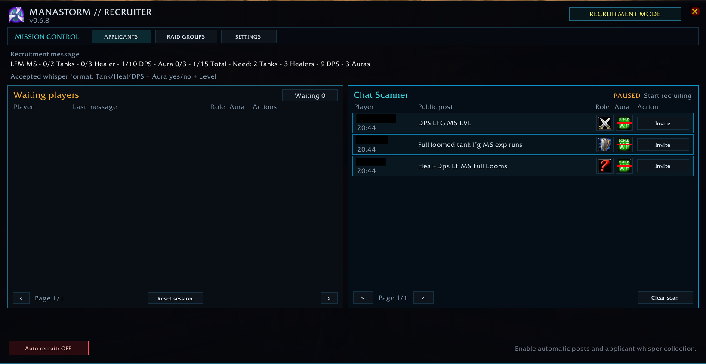
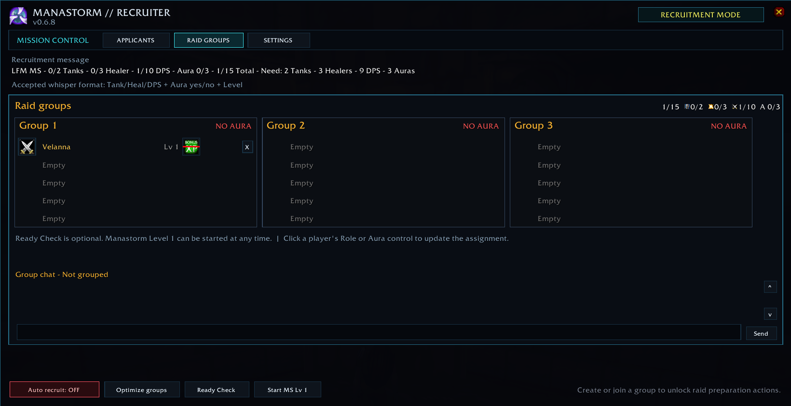
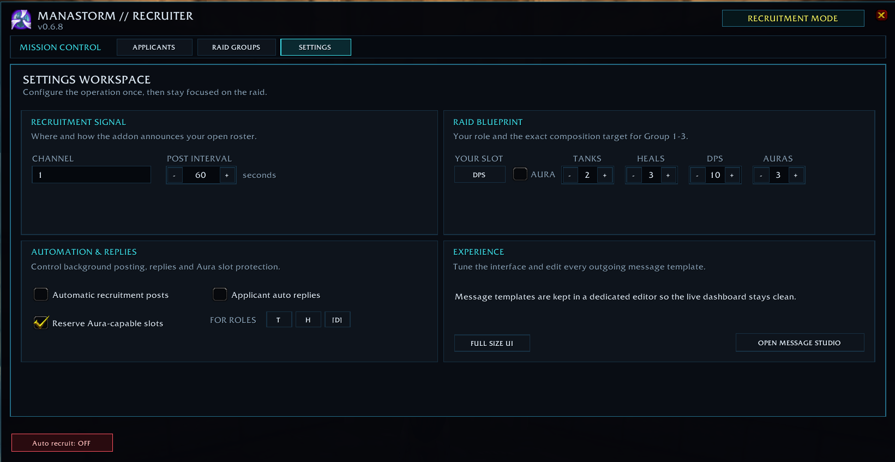

# Manastorm Recruiter

Manastorm Recruiter is an unofficial World of Warcraft addon for Project Ascension's WoW 3.3.5 client. It helps raid leaders recruit players, track roles and Manastorm Auras, arrange a 15-player raid, monitor the run, rebuild after players reach level 60, and leave cleanly.

## Compatibility

- Project Ascension
- WoW 3.3.5 interface `30300`
- English client communication

This community project is not affiliated with Blizzard Entertainment or Project Ascension.

## Installation

1. Download and extract the release ZIP.
2. Copy the `ManastormRecruiter` directory to `ascension-live\Interface\AddOns\`.
3. Restart WoW or reload AddOns from the character-selection screen.
4. Enter `/msr` in game.

The window can also be opened with the movable minimap button.

## Quick Start

1. Open **Settings** in the Mission Control navigation and select the recruitment channel, your role, your Aura status, and the automatic post interval.
2. Check the roster targets. The defaults are 2 Tanks, 3 Healers, 10 DPS, 3 Auras, and 15 players.
3. Click **Auto recruit: OFF** to enable automatic posts and applicant-whisper collection. The first post is sent after the configured interval; the button itself does not post a message.
4. Review applicants in **Waiting**, correct their role or Aura if needed, and invite or reserve them.
5. Use **Optimize groups** to arrange Groups 1-3, then optionally run a **Ready Check**.
6. Click **Start MS Lv 1** to enter Manastorm.
7. During the run, watch roster warnings and use **Rebuild raid** when level-60 players must be replaced.
8. Finish with **Post & Leave**.

## Mission Control Interface

Version 0.6.8 introduces a focused operations layout instead of exposing every control in one toolbar:

- **Applicants** uses a full-width waiting list with the latest player message visible beside each application.
- The Applicants workspace is split between private applications and a live public-channel **Chat Scanner** while recruiting.
- **Raid Groups** uses a separate full-width workspace with larger group cards and direct Role/Aura assignment controls.
- Role assignments use class-style role icons; Aura state uses the bundled Bonus XP icon consistently on both pages.
- **Settings** groups recruitment signal, raid blueprint, automation, Aura reservations and appearance controls into separate cards.
- **Open Message Studio** lives inside Settings so message editing stays out of the live navigation.
- The header status capsule always shows whether the addon is recruiting, building a raid, running Manastorm or rebuilding.
- The dark cyan-and-gold visual language uses custom flat controls and stable geometry designed for both native Ascension UI and ElvUI.

### Screenshots

#### Applicants and Chat Scanner



#### Raid Groups



#### Settings



## Recruitment

Applicants can whisper simple English messages such as:

```text
tank aura yes level 42
heal no aura 37
dps yes
```

The addon recognizes the role, Aura status, and a level from 1 to 60. It asks for missing information and accepts short follow-ups such as `yes`, `no`, `42`, or `lvl 42`. A missing level does not block an invite.

Automatic replies explain when the raid or role is full, an Aura-reserved slot is unavailable, or the raid is already inside Manastorm. Disable **Auto reply** in Settings if you prefer to answer manually.

While recruitment is running, the Chat Scanner watches public channel messages that combine `MS`, `Manastorm`, or `Manastorms` with `LF` or `LFG`. It ignores `LFM` group advertisements and Loom gear terminology. It keeps the newest post per player, infers role and Aura information when present, and offers a direct Invite action. **Clear scan** removes only public scan results; it does not remove whisper applicants.

The **Waiting** tab provides these actions:

- Change the stored role or Aura status.
- **Invite** and reserve a roster slot while the invitation is pending.
- **Reserve** the applicant without inviting.
- **Release**, **Reinvite**, or reject an applicant.

Players invited outside the addon are added to the editable roster when detected.

## Raid Workflow

The raid overview shows Groups 1-3 with each player's role, level, Aura, Ready Check state, and subgroup. It also provides roster posting, group chat, member removal, raid disbanding, and session reset actions.

### Group Optimization

The intended 15-player arrangement is:

- Group 1: 1 Tank, 1 Healer, 3 DPS
- Group 2: 1 Tank, 1 Healer, 3 DPS
- Group 3: 1 Healer, 4 DPS
- At least one Aura player in each group

Group optimization is intentionally step-by-step because WoW confirms subgroup moves asynchronously. The button must therefore be clicked several times: click **Optimize groups**, wait for the move, then keep clicking **Verify / next** until the addon reports that all moves are complete. Groups 4-8 may be used temporarily as a move buffer.

### Manastorm and Rebuild

**Start MS Lv 1** sends Ascension's entry request and stops recruitment. During the run, the addon warns about missing players, roles, or Auras and announces levels 59 and 60 with configurable messages.

Use **Rebuild raid** when players reach level 60:

1. Confirm the rebuild and wait for the countdown.
2. Remove the current raid members when prompted.
3. Leave Manastorm when prompted.
4. The addon reinvites eligible players and leaves level-60 players out.
5. Recruit replacements and optimize the groups again.

The rebuild state is saved. After `/reload` or a client restart, the addon offers to resume or discard an unfinished rebuild. Failed protected actions remain available as retry buttons.

### Leaving

**Post & Leave** posts the configured final status, leaves Manastorm if necessary, and then leaves the party or raid. If the exit cannot be confirmed, the addon keeps you grouped so the order can be completed manually.

## Settings and Messages

Settings include roster targets, automatic posting, automatic replies, Aura-slot reservation, window scaling, and editable recruitment, warning, rebuild, and leave messages.

The Message Studio and its editor can be dragged by their background or header. Standalone raid messages provide three compact output controls: `R` for raid/party chat, `!` for raid warning, and `S` for a local system-style message visible only to you. Clicking the active output again disables that message. Recruitment posts remain tied to the configured recruitment channel, applicant replies remain private whispers, and suffix templates inherit the output of their parent message.

Common message placeholders include:

- Missing requirements: `{needed}`, `{tankNeeded}`, `{healNeeded}`, `{dpsNeeded}`, `{auraNeeded}`
- Counts: `{tank}`, `{heal}`, `{dps}`, `{aura}`, `{total}` and their `Max` variants
- Context: `{player}`, `{role}`, `{level}`, `{seconds}`, `{auraPlayers}`, `{reservation}`, `{status}`

## Commands

- `/msr` or `/manastormrecruiter` - Show or hide the window
- `/msr post` - Post the recruitment message once
- `/msr listen` - Toggle applicant whisper detection
- `/msr optimize` - Continue group optimization
- `/msr testwhisper dps aura yes` - Simulate an applicant
- `/msr test59 Testplayer` - Test the level 59 warning
- `/msr test60 Testplayer` - Test the level 60 warning
- `/msr reset` - Reset the current session after confirmation

## Privacy

The addon has no telemetry, accounts, API keys, or external network requests. It stores settings, customized messages, applicant whispers, matched public recruitment posts, roster data, warning state, and rebuild recovery data locally in WoW SavedVariables.

Use **Reset session** or `/msr reset` to clear the current session. To remove all settings, uninstall the addon and delete its `ManastormRecruiter.lua` and `.bak` SavedVariables files from the account and character `WTF` directories. No player data is included in the repository or release packages.

## Development and Testing

The source is separated into core state and events (`Core.lua`), whisper parsing (`Parser.lua`), roster and group optimization (`Roster.lua`), recruitment (`Recruitment.lua`), Manastorm handling (`Manastorm.lua`), rebuild recovery (`Rebuild.lua`), and the interface (`UI.lua`).

Run the automated tests from the repository root:

```text
lua tests/CoreTests.lua
lua tests/UITests.lua
```

Invitation, subgroup, Ready Check, Manastorm, and protected raid actions must also be tested in the real Project Ascension client before a live raid.

Release archives contain one top-level `ManastormRecruiter` directory with the `.toc` and Lua source files. Tests and repository-maintenance files are not required in the installed addon.

## License

Copyright (C) 2026 Tomatensalat91

Licensed under the GNU General Public License v3.0 or later. See [LICENSE](LICENSE).
